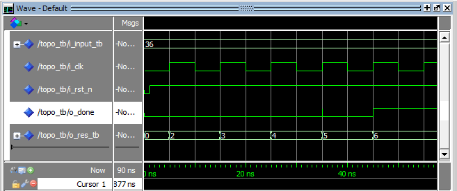

<h1 align="center">Raiz Quadrada - VHDL</h1>
<h3 align="center">Descrição de Hardware de um código que calcula a raiz quadrada de números positívos.</h3>

## Resumo

 
<a>Com base num algoritmo em <i>C</i> que calcula a raiz quadrada, foi desenhado um circuito, Bloco de Controle e de Dados, utilizando o software <i>Logisim</i>. Após isso, foi utilizado o software <i>Quartus</i> para descrever o mesmo utilizando VHDL, onde o Bloco de Controle foi feito de forma Estrutural para fazer jus ao circuito desenhado no <i>Logisim</i>. Para testar as formas de onda foi utilizado o software <i>ModelSim</i> que pode ser baixado junto com o <i>Quartus</i>.</a> 

<a> Ao longo do desenvolvimento do circuito foram feitas otimizações que podem ser vistas a seguir. </a>

<a> Os arquivos VHDL foram sintetizados, com ferramentas da <i>Cadense</i>, utilizando a litografia de 180nm e assim consegui-se um clock de 127.7MHz com <i>time slack</i> de 0 ps. É possível chegar no resultado com <i>resultado-1</i> números de clock. O mesmo foi simulado com atrasos de portas lógicas nesta frequência e não demonstrou nenhum erro no cálculo da raiz porém alguns <i>spikes</i> foram detectados mas não prejudicam o funcionamento do mesmo. </a>

## Visão Rápida

 
 <a>Código em C tomado como base para fazer o circuito.</a>

 
 

 
 <a>Comparação da primeira versão com uma mais atual, onde os círculos demonstram o que foi otimizado.</a>

 

 
 <a>Circuito atual contendo o esquemático do Bloco de Controle e de Dados .</a>

 

 
 <a>Máquina de estados utilizada para fazer o Bloco de Controle que pode ser gerado a partir do Logisim.</a>

 

 
 <a>Demonstração do Funcionamento do Circuito.</a>

 
  

  

## VHDL

 
 <a>O código possui uma topologia, onde cada unidade que faz alguma operação importante foi descrita. Os arquivos <i>add1rip.vhd, adder.vhd, addsub.vhd, dffa.vhd, gen_reg.vhd, mux.vhd</i> foram cedidos pelo Professor Mateus B. da Disciplina de Sistemas Embarcados II para descrever este circuito e também como forma de avaliar igualitariamente o desempenho do circuito dos colegas de turma.</a>

 

 
 <a>Simulação do cálculo de raiz do número <i>36 </i> feito no ModelSim .</a>

 

## SÍNTESE

 
 <a>Simulação do cálculo de raiz do número <i>37 </i>  feito no <i>SimVision</i>, que considera tempos de atraso, cujo tempo de ciclo foi de 7.83ns na litografia de 180nm.</a>

 

